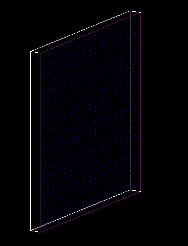
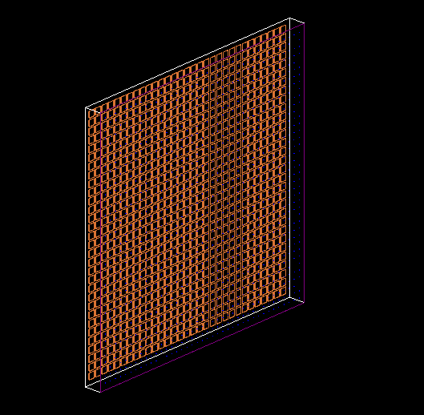
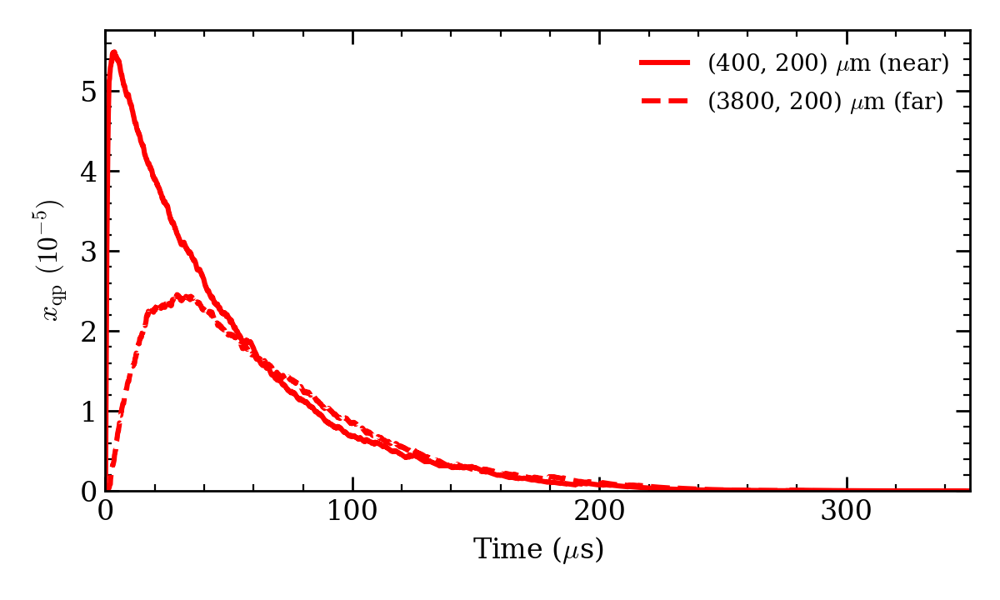
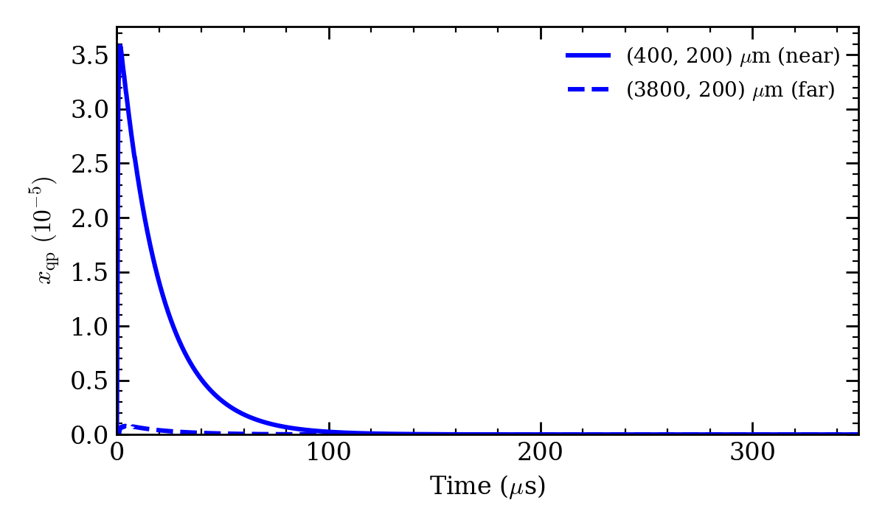

# Radiation-Induced Quasiparticle Response

This repository contains a Geant4/G4CMP Monte Carlo simulation of radiation-induced phonons and quasiparticles in a superconducting detector structure. It is used to study how energy deposited in a silicon substrate can create quasiparticles in small aluminum electrode patches, and how the resulting signal changes with position and time.

## What the program does

The simulation models the following chain:

1. The macro injects 27,777 primary electron-hole pairs near the top-center of the silicon substrate, with a total kinetic energy of $2.43\ \mathrm{eV}$ per pair. For each event, the primary generator randomly splits this energy uniformly between the electron and hole.
2. Geant4/G4CMP transports the resulting charge carriers and phonons through the crystal, including phonon scattering, down-conversion, trapping, and boundary interactions. The default macro sets both the electron and hole trapping mean free paths to $300\ \mu\mathrm{m}$, so each carrier can be trapped during transport according to its configured mean free path.
3. The silicon is coupled to a patterned niobium film containing a grid of aluminum patches. When a phonon is absorbed by an aluminum patch, the code models the resulting Kaplan quasiparticle cascade.
4. The program writes the creation time, location, and quasiparticle yield for each absorbed phonon event.

The output is intended to quantify the radiation response of a superconducting detector, rather than to simulate individual quasiparticle tracks. One output row represents the quasiparticles produced by one instantaneous thin-film cascade.

## Simulated detector

The default geometry includes:

- an $8\ \mathrm{mm} \times 8\ \mathrm{mm} \times 525\ \mu\mathrm{m}$ silicon substrate;
- a $120\ \mathrm{nm}$ niobium film on the top surface;
- a $31 \times 31$ grid of $10\ \mu\mathrm{m}$ square aluminum patches spaced by $200\ \mu\mathrm{m}$;
- phonon loss and diffuse reflection at the silicon side walls; and
- a bare, lossless backside in the current default geometry.

The code contains an option to enable backside-copper construction for comparing a copper down-converting layer with the no-copper case. To enable/disable `ChargeDetectorConstruction.cc`, comment or uncomment the 'ConstructBacksideCopper(worldLogical, siliconPhysical);' line in the `SetupGeometry()` method.

<table>
    <tr>
        <td></td>
        <td></td>
    </tr>
</table>
The left image shows the default no-copper geometry, and the right image shows the optional backside copper layer. The niobium film is the purple outline, and the aluminum patches are the small blue squares on the front of the chip. The copper islands are the orange-brown squares on the back of the chip.

## Files

- `g4cmpCharge.cc`: application entry point and Geant4/G4CMP initialization.
- `charge_to_qp.mac`: example batch macro. It runs 27,777 events with 20 worker threads and writes `qp_creation.txt`.
- `vis_eh.mac`: example visualization and low-energy electron-hole-pair configuration.
- `analysis/plot_xqp_vs_time.py`: reads the quasiparticle CSV output and produces an $x_{qp}(t)$ plot for selected near and far aluminum patches.
- `results/`: example simulation output and run-summary files.

- `ChargeActionInitialization`: registers the application actions, including the primary generator, run action, G4CMP stacking action, and stepping action.
- `ChargeConfigManager`: initializes configuration from environment variables, owns the configuration messenger, and requests geometry reconstruction when geometry-related settings change.
- `ChargeConfigMessenger`: defines `/g4cmp/voltage`, `/g4cmp/scaleEPot`, `/g4cmp/EPotFile`, `/g4cmp/HitsFile`, and `/g4cmp/orientation` commands and forwards their values to the configuration manager.
- `ChargeDetectorConstruction`: defines materials and builds the silicon detector geometry, niobium and aluminum films, phonon boundary models, crystal lattice, and optional backside-copper geometry.
- `ChargeElectrodeSensitivity`: filters absorbed phonon hits at aluminum patches, converts deposited energy to `QPs Created` using the aluminum gap energy, and writes per-thread CSV files with event, time, and patch coordinates.
- `ChargePrimaryGeneratorAction`: uses a Geant4 particle gun; when no particle is explicitly selected, it splits the configured energy randomly between one drift electron and one drift hole with independent random directions.
- `ChargeRunAction`: writes an incomplete marker before a run, then records requested and completed event counts and marks the run complete only when all events finish.
- `ChargeSteppingAction`: stops zero-energy charge carriers and discards carriers with non-finite energy, momentum, or direction before invalid kinematics can reach another G4CMP process.

### Build configuration

- `CMakeLists.txt`: locates G4CMP and Geant4, selects the C++ standard, compiles the executable and application sources, links the required libraries, and defines installation rules.

## Results of simulation

For the no-copper geometry, the quasiparticle yield in the aluminum patches is plotted below based on the "What the program does" section above. The plot shows the quasiparticle density $x_{qp}$ as a function of time for two aluminum patches: one near the energy deposition site and one far away.

For the backside-copper geometry, the quasiparticle yield in the aluminum patches is plotted below. The plot shows the quasiparticle density $x_{qp}$ as a function of time for two aluminum patches: one near the energy deposition site and one far away.

In both cases, the near patch shows a rapid rise in quasiparticle density followed by a decay, while the far patch shows a delayed and lower peak. The presence of the copper layer lowers the overall quasiparticle yield.

## (Extra) Comparison of Random and Equal Energy Splitting

During the planning of the simulation, an idea was talked about if evenly splitting the kinetic energy between the electron and hole would yield the same result as randomly splitting the energy. To test this, a simulation was run using the same configuration as charge_to_qp.mac for the non-copper backside chip, except that the electron and hole each received exactly half of the total kinetic energy. The resulting plot is shown below. The results are nearly identical to the random split case, indicating that the method of splitting the energy does not significantly affect the quasiparticle yield in this simulation.

## Interpretation and limitations

- During the simulation, a small number of phonons were observed escaping the silicon substrate. These occurrences were extremely rare, with only an occasional escape across many events, each of which generated a large number of phonons. Due to the low frequency of these occurrences, determining the exact mechanism by which the phonons escaped was difficult. However, the number of escaped phonons is negligible compared with the total number generated and is therefore not expected to significantly affect the overall simulation results.

- The simulation models phonon absorption in the aluminum patches and the subsequent quasiparticle production through the G4CMP thin-film Kaplan cascade. However, individual quasiparticles are not explicitly tracked after their creation, so spatial diffusion within the aluminum, transport between regions, edge losses, and position-dependent recombination are not modeled microscopically. The reported quasiparticle yield therefore represents the instantaneous number of quasiparticles generated by the absorbed phonon energy and should be interpreted as an upper-limit estimate before spatial transport and additional loss mechanisms. The time-dependent post-processing applies phenomenological recombination and trapping rates, but these provide only a spatially averaged approximation and do not replace a full diffusion-recombination treatment.